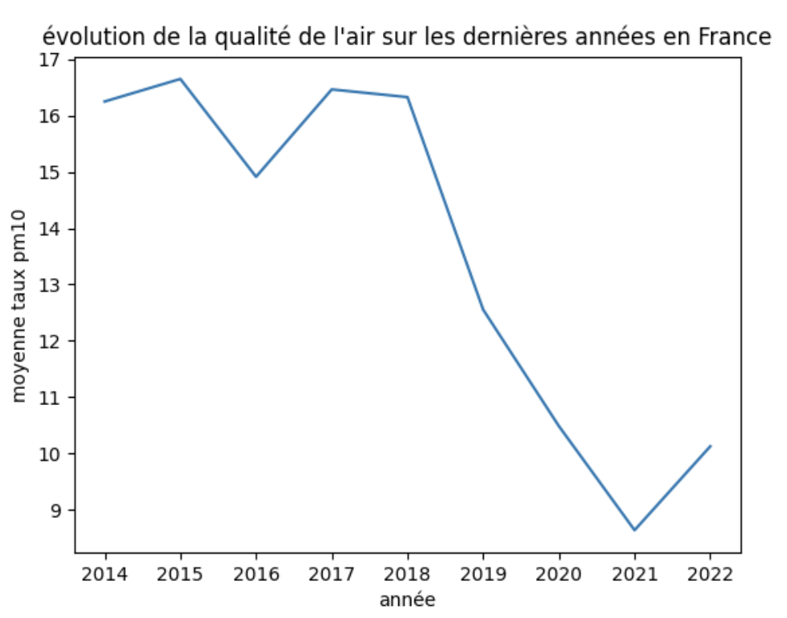
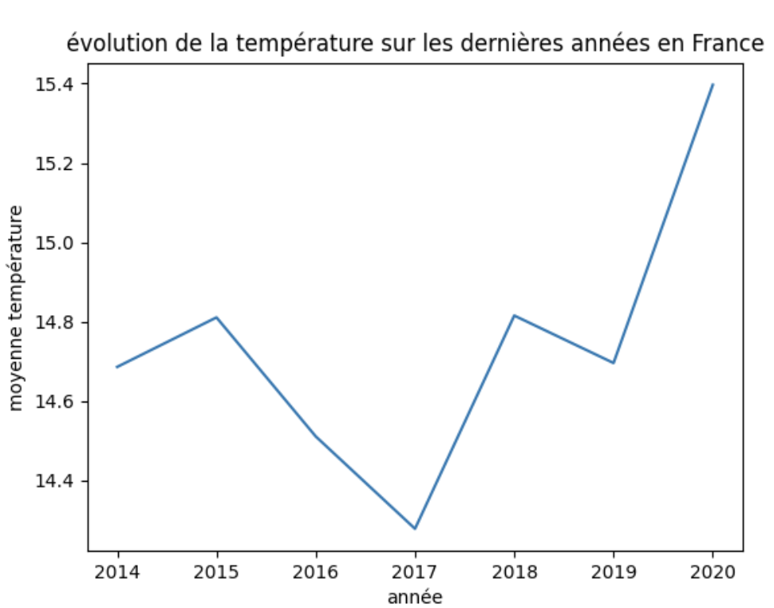
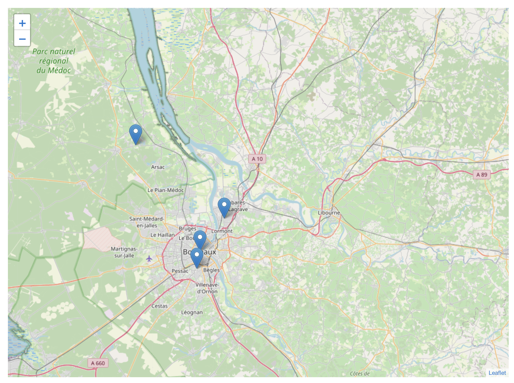
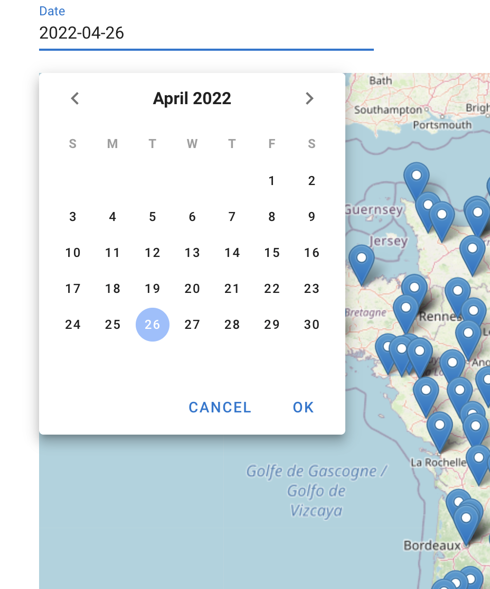

# webmap

## Installer vue js

Vérifiez d'abord s'il est déjà installé

```shell
vue --version
```

- Si non installé :

```shell
npm install -g @vue/cli
# OR
yarn global add @vue/cli
```

- Si installé :

```shell
npm update -g @vue/cli
# OR
yarn global upgrade --latest @vue/cli
```

## Configuration du projet

Copiez le contenu de .env.example dans votre propre .env

```shell
cp .env.example .env
```


##### Si vous allez re-push dans ce repository n'oubliez pas de paramétrer votre .gitignor en ajoutant :

##### Et pour valider et pousser .gitignore en premier

```shell
.env
```


Installer les dépendances

```shell
npm install
```

Lancez le server en locale

```
npm run serve
```

Rendez vous sur l'application une fois le server lancé en locale

[http://127.0.0.1:8080/](http://127.0.0.1:8080/) ou [http://localhost:8080/](http://localhost:8080/)

## Comment fonctionne le site

Tout d'abord vous allez pouvoir trouver sur la gauche des diagrammes de prévision sur la qualité de l'aire et les températures.

 

Par la suite vous pouvez trouver la carte affichée ciblée sur la France ou plusieurs icons afficherons au passage de la souris les informations concernant la ville sélectionnée.


Vous pouvez zoomer ou dézoomer de façon à avoir une meilleure visibilité.



Vous trouverez également un sélecteur de dates (choix par années, mois et jours) qui dynamiquement récupérera les données d'air et de températures par ville.




### Documentation
[Vue js](https://fr.vuejs.org/v2/guide/installation.html) pour la partie visuelle et récupération des données.

[Leaflet](https://vue2-leaflet.netlify.app/quickstart/) qui est importé pour l'affichage de la carte et son contenue.

[Vuetify](https://vuetifyjs.com/en/getting-started/installation/) qui a permet d'intégrer et d'utiliser des composants tels que le sélecteur de date.

La documentation pour pouvoir se servir des scripts d'entrainement des réseaux de neuronnes est disponible dans le dossier "Deep_learning_pipes", elle fournie l'arborescence nécessaire à l'exécution des scripts (qui sont à exécuter en ligne de commande).